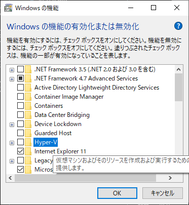
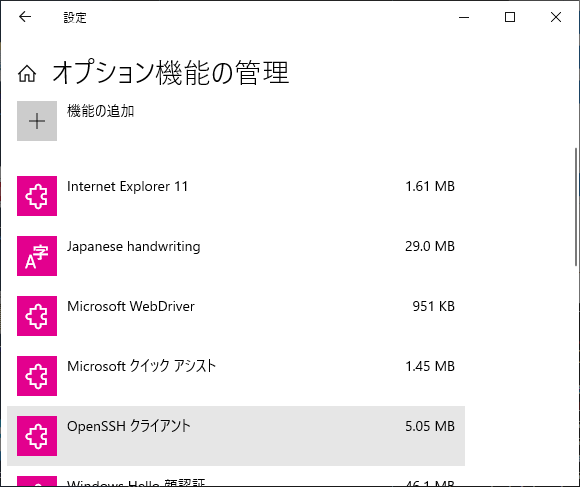

# GRAND MENU
\* in my usecase
## Operating Environment
- VirtualBox [6.0(windows)](https://download.virtualbox.org/virtualbox/6.0.10/VirtualBox-6.0.10-132072-Win.exe)
- Vagrant [2.2.5(windows)](https://releases.hashicorp.com/vagrant/2.2.5/)
- centos/7 ([vagrant box](https://app.vagrantup.com/centos/boxes/7))

### attention
- for windows, REQUIRED deactivate Hyper-V (to avoid compete vagrant)



- for windows, activate `open-ssh` (recommend)



### Vagrantfile options
- the goal is using [express](https://expressjs.com/) `environment, so set port `3000`
```ruby
  config.vm.network "private_network", ip: "192.168.33.10", guest: 3000, host: 3000
```
- set memory (my vagrant light-fingered)
```ruby
  config.vm.provider "virtualbox" do |vb|
  #   # Display the VirtualBox GUI when booting the machine
  #   vb.gui = true
  #
  #   # Customize the amount of memory on the VM:
    vb.memory = "1024"
  end
```

## Course
flow order
- update `yum`
- install `wget`, `vim`, `httpd`, `gcc-c++`, `make`
- disable SELinux (should do reboot, to activate)
- add repo PHP73
- install PHP familly
  - `php`
  - `php-common`
  - `php-opcache`
  - `php-mcrypt`
  - `php-cli`
  - `php-gd`
  - `php-curl`
  - `php-mysqlnd`
- add repo phpmyadmin
- install phpmyadmin
- overload `/etc/httpd/conf.d/phpMyAdmin.conf` (to use phpmyadmin)
- install MariaDB rpm
- add repo MariaDB
- install MariaDB
- install node (from nodesource)

## digestif
- reboot for activate selinux
- `mysql_secur_installation` to phpmyadmin